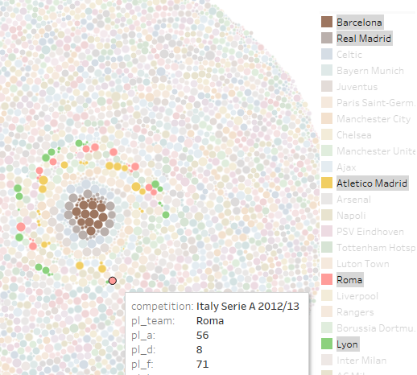

# PRA1_webscraping_skysports

## Integrantes
Iván Calvo Revelo
Santiago Domínguez Collado

## Arquitectura del proyecto:

* parser.py: fichero que convierte el archivo html de entrada y genera ficheros con las tablas como salida.
* fetcher.py: toma como entrada una url y genera un html como salida.
* 01.txt: archivo con url como semilla para iniciar el scraping.
* fetcher.conf y parser.conf: ficheros utilizados como condición de parada en ejeción en paralelo.
* fetcher-explored: directorio de archivos html de las url que ya ha explorado el fetcher.
* fetcher-queue: directorio de archivos con las url que aún no ha descargado el fetcher.
* parser-queue: directorio de archivos html de las url de los que aún no se han extraido las tablas.
* output: directorio en el que se almacenan las tablas extraidad por el parser.

## Instrucciones:

Tanto fetcher.py como parser.py correran indefinidamente mientras la primera linea de sus correspondientes archivos fetcher.conf y parser.conf sea distinta de 'stop'.

Para hacer una ejecucion de prueba:
* Crear carpetas fetcher-queue y parser-queue si no están.
* Borrar el contenido de las carpetas fetcher-queue, parser-queue, fetcher-explored y output si están.
* Copiar 01.txt a la carpeta fetcher-queue.
* Asegurarse de que los ficheros .conf contengan como primera linea la palabra 'stop'.
* Ejecutar fetcher.py y comprobar como se llena la carpeta parser-queue.
* Ejecutar parser.py y comprobar como se llenan las carpetas fetcher-queue y output.
* Continuar ejecutando sucesivamente fetcher.py y parser.py, comprobando como se llena la carpeta output.

Cuidado al ejecutar el fetcher y el parser a la vez, no he comprobado que condiciones de carrera puede haber si tratan de acceder al mismo archivo. Son necesarias 3 ejecuciones para extraer todas las tablas de la web.
